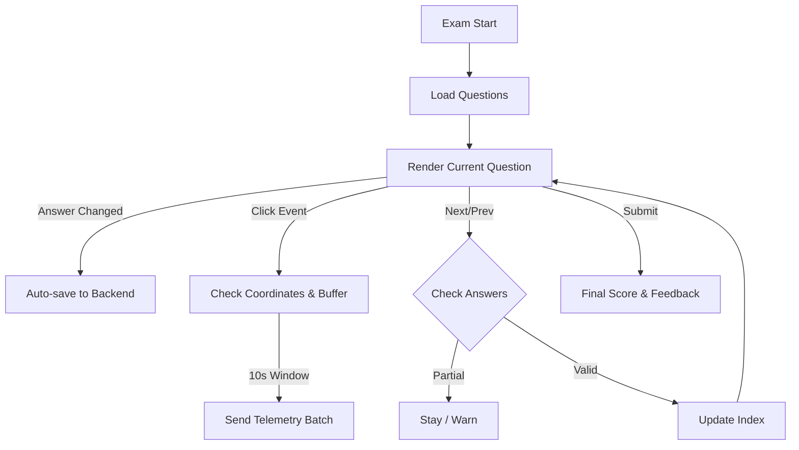

# 🎨 CognitoMark Frontend

A premium, real-time interface for the High-Fidelity Exam Portal. Built with Next.js, it features glassmorphism aesthetics and advanced behavioral tracking.

---

## 📂 Exhaustive File Structure

| Path | Description |
| :--- | :--- |
| `src/app/` | Next.js App Router. Contains global layout and page entry points. |
| `src/screens/student/` | Student views: Login, Exam Picker, and the high-fidelity Exam Interface. |
| `src/screens/admin/` | Admin views: Live Dashboard, Student/Session management, and Reports. |
| `src/components/` | Reusable UI: `Sidebar`, `Navbar`, `ConfirmModal`, `MetricCard`, and Auth Guards. |
| `src/api/` | API service wrappers for backend communication. |
| `src/hooks/` | Custom React hooks for socket connections and telemetry. |
| `src/utils/` | Shared utilities for formatting and data processing. |
| `src/index.css` | Core design system with glassmorphism and modern UI tokens. |

---

## 📊 Way of Working: Exam Interface State

---

## 💎 Design Aesthetics

- **Glassmorphism**: Subtle translucent backgrounds with frosted glass effects.
- **Micro-animations**: Smooth transitions for sidebars and modals.
- **Dynamic Telemetry**: Live stress-bar and click visualization for admins.
- **Responsive Layout**: Seamless experience across different screen sizes.

---

## 🛠️ Development

### Setup
1. `cd frontend`
2. `npm install`
3. Configure `.env`:
   - `NEXT_PUBLIC_API_URL`
   - `NEXT_PUBLIC_SOCKET_URL`
4. `npm run dev` (Starts development server on port 3000)